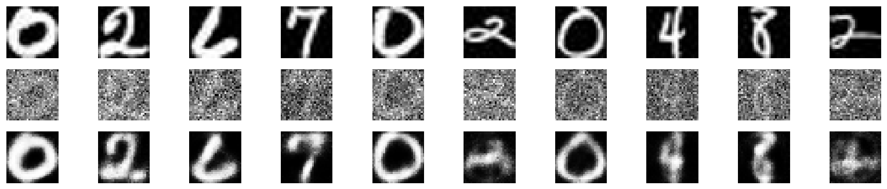

# denoising using deep learning techniques

## Installation

To run the code, you'll need to install the following Python packages. You can install them using `pip`:

```bash
pip install numpy matplotlib keras Pillow
```

## 1. **Introduction**

- The goal of this project is to create a denoising autoencoder using deep learning techniques to remove noise from images in a custom dataset.

## 2. **Data Loading and Preprocessing**

- Data Folder Structure:
The dataset is organized into "train" and "test" folders, each containing images.
- Image Loading and Conversion:
Images are loaded using the Python Imaging Library (PIL).
Images are converted to grayscale ('L' mode).
- Image Resizing:
Images are resized to a common size (28x28 pixels) to ensure uniformity.

## 3. **Adding Noise to the Data**

- Noise Addition:
    - Gaussian noise is added to the images using the NumPy library.
    - The level of noise is controlled by the noise_factor parameter. 

## 4. **Autoencoder Model**

- Model Architecture:
  - An autoencoder is used for the denoising task.
  - The model consists of an encoder and a decoder.
  - The encoder reduces the dimensionality of the input, and the decoder reconstructs the original image.
- Neural Network Layers:
  - The input layer has a shape of 28x28 (size of the images).
  - The encoder has a dense layer with 128 neurons and 'relu' activation.
  - The decoder has a dense layer with 28x28 neurons and 'sigmoid' activation.
- Model Compilation:
  - The model is compiled using the Adam optimizer and binary cross-entropy loss, suitable for binary classification problems.
  - In section 1, a brief explanation is given about Adam optimization

## 5. **Training the Autoencoder**

- Training Parameters:
  - The autoencoder is trained using the noisy images (custom_data_noisy_reshaped) and the corresponding clean images (custom_data_reshaped).
  - Training occurs over 10 epochs with a batch size of 256.
  - The training process aims to minimize the binary cross-entropy loss.

## 6. **Denoising Process**

- Denoising Application:
  - The trained autoencoder is applied to the noisy training and test datasets to generate denoised images.
  - Denoised images are obtained by passing the noisy images through the autoencoder model.

## 7. **Future Improvements**

- Hyperparameter Tuning:
  - Experiment with different hyperparameters such as the number of layers, neurons, and learning rates to improve performance.
- Architecture Modifications:
  - Explore more complex autoencoder architectures, such as convolutional autoencoders, for better noise removal.

## 8. **Algorithm Used**
- Denoising Autoencoder:
  - Autoencoders are a type of neural network designed for unsupervised learning.
  - The architecture is symmetric, with an encoder compressing the input, and a decoder reconstructing the original input.
  - In this case, the autoencoder is trained to denoise images by learning a compact representation of the clean images and reconstructing them from noisy versions.

## 9. **Visualization**
Low noise


Mid noise


High noise

